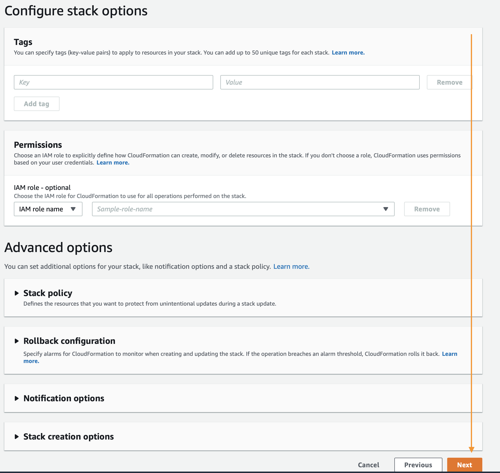

# Getting Started

The tutorial below will walk you through building an environment to create a custom dataset, model, and recommendation campaign with Amazon Personalize. If you have any issues with any of the content below please open an issue here in the repository.

## Prerequisites

Only applies if you are deploying with the CloudFormation template, otherwise consult the IAM permissions needed for your specific task.

1. AWS Account
2. User with administrator access to the AWS Account

## Re:Invent 2019

If you are building this workshop for Re:Invent 2019 simply click the Launch Stack button below. Get your Jupyter Notebook Instance running, and open the "getting_started" folder and `ReInvent2019_Workshop.ipynb`!

Follow along with the screenshots if you have any questions about these steps.

### Cloud Formation Wizard

Start by clicking `Next` at the bottom like shown:

In the next page you need to provide a unique S3 bucket name for your file storage, it is recommended to simply add your first name and last name to the end of the default option as shown below, after that update click `Next` again.

This page is a bit longer so scroll to the bottom to click `Next`.

Again scroll to the bottom, check the box to enable the template to create new IAM resources and then click `Create Stack`.

For a few minutes CloudFormation will be creating the resources described above on your behalf it will look like this while it is provisioning:

Once it has completed you'll see green text like below indicating that the work has been completed:

## Agenda

The steps below outline the process of building your own recommendation model, improving it, and then cleaning up all of your resources to prevent any unwanted charges. To get started executing these follow the steps in the next section.

1. `ReInvent2019_Workshop.ipynb`  - Guides you through building your first campaign and recommendation algorithm. 

## Using the Notebooks

Start by navigating to the SageMaker serivce page by clicking the `Services` link in the top navigation bar of the AWS console.

In the search field enter `SageMaker` and then click for the service when it appears, from the service page click the `Notebook Instances` link on the far left menu bar.

To get to the Jupyter interface, simply click `Open JupyterLab` on the far right next to your notebook instance.

Clicking the open link will take a few seconds to redirect you to the Jupyter system but once there you should see a collection of files on your left. Get started by clicking on `1.Building_Your_First_Campaign.ipynb`.

The rest of the lab will take place via the Jupyter notebooks, simply read each block before executing it and moving onto the next. If you have any questions about how to use the notebooks please ask your instructor or if you are working independently this is a pretty good video to get started:

https://www.youtube.com/watch?v=Gzun8PpyBCo

## After the Notebook

Once you have completed all of the work in the Notebooks and have completed the cleanup steps there as well, the last thing to do is to delete the stack you created with CloudFormation. To do that, inside the AWS Console again click the `Services` link at the top, and this time enter in `CloudFormation` and click the link for it.

Click the `Delete` button on the demo stack you created:

Lastly click the `Delete Stack` button that shows up on the popup:

You'll now notice that the stack is in progress of being deleted. Once you see `Delete Completed` you know that everything has been deleted and you are 100% done with this lab.

